# 선박용 엣지 AI 의료 지원 시스템

### 팀명 : MDTS

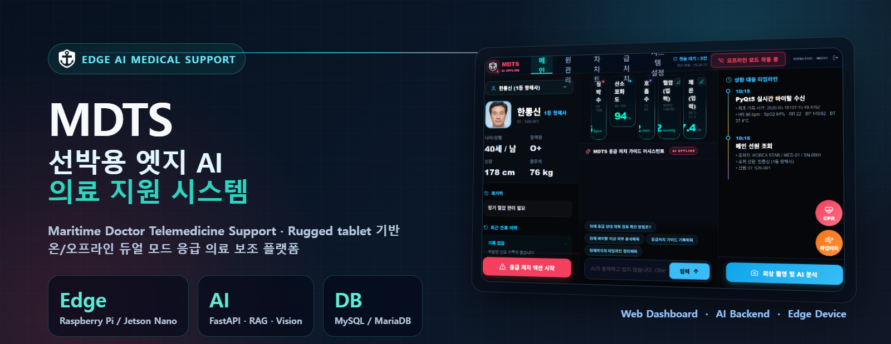

> 의료 안전 안내: AI 분석 결과는 응급처치 보조 정보이며, 의료진의 진단과 선장·의료관리자의 최종 판단을 대체하지 않습니다.

## 서비스 소개

* 서비스명 : MDTS(Maritime Doctor Telemedicine Support)
* 서비스 설명
  * 러기드 태블릿 기반 선박용 엣지 AI 의료 지원 시스템
  * 선박 내 응급 상황에서 선원 정보, 바이탈 데이터, 외상 이미지, AI 분석 결과를 통합 관리
  * 온라인/오프라인 듀얼 모드를 고려하여 웹 대시보드, AI 백엔드, 센서 디바이스를 분리 운영
  * Vercel 배포 웹 대시보드를 통해 브라우저에서 서비스 화면 확인 가능

## 프로젝트 기간

* 2026.05 기준 공유 버전

## 주요 기능

* 선원 정보 및 환자 상태 웹 대시보드
* 바이탈 데이터 조회 및 응급 환자 상태 관리
* 외상 촬영 이미지 기반 AI 분석 연동
* FastAPI 기반 의료 AI 백엔드 연동
* Raspberry Pi / Jetson Nano 기반 센서 및 카메라 장치 연동
* MySQL/MariaDB 기반 선원·바이탈 데이터 관리
* Vercel 기반 프론트엔드 배포

## 배포 및 GitHub 링크

| 구분 | GitHub | 배포 |
| --- | --- | --- |
| 공개 포트폴리오 README | [2025-SMHRD-IS-EdgeAI-2/mdts_maritime_medic](https://github.com/2025-SMHRD-IS-EdgeAI-2/mdts_maritime_medic) | - |
| MDTS 통합 데모 | [Capernaum-user/mdts-maritime-medic-integrated-demo](https://github.com/Capernaum-user/mdts-maritime-medic-integrated-demo) | [frontendaibackend.vercel.app](https://frontendaibackend.vercel.app) |
| MDTS 웹 대시보드 | [eelishalee/-maritime-medic](https://github.com/eelishalee/-maritime-medic) | [maritime-medic-five.vercel.app](https://maritime-medic-five.vercel.app) |

> 참고: `Capernaum-user/mdts-maritime-medic-integrated-demo`는 Private 저장소이므로 GitHub 코드 열람에는 권한이 필요합니다. 배포 링크는 브라우저에서 확인할 수 있습니다.

## 기술스택

<table>
  <tr>
    <th>구분</th>
    <th>내용</th>
  </tr>
  <tr>
    <td>사용언어</td>
    <td>
      
      
      
      
    </td>
  </tr>
  <tr>
    <td>Front-End</td>
    <td>
      
      
      
    </td>
  </tr>
  <tr>
    <td>Back-End</td>
    <td>
      
      
      
    </td>
  </tr>
  <tr>
    <td>AI / Data</td>
    <td>
      
      
      
      
    </td>
  </tr>
  <tr>
    <td>데이터베이스</td>
    <td>
      
      
    </td>
  </tr>
  <tr>
    <td>Edge / Device</td>
    <td>
      
      
      
    </td>
  </tr>
  <tr>
    <td>협업도구</td>
    <td>
      
      
    </td>
  </tr>
</table>

* 주요 활용 언어 : Python(Back-End / AI / Device), JavaScript(Front-End)
* Front-End 세부 스택 : React, Vite, Vercel
* Back-End 세부 스택 : Node.js, Express, FastAPI
* AI 세부 스택 : MobileNetV3 Large, RandomForest, Ollama, RAG, ChromaDB
* Device 세부 스택 : Raspberry Pi, Jetson Nano, PyQt5
* DataBase : MySQL, MariaDB
* 형상 관리 도구 : GitHub

## 시스템 아키텍처

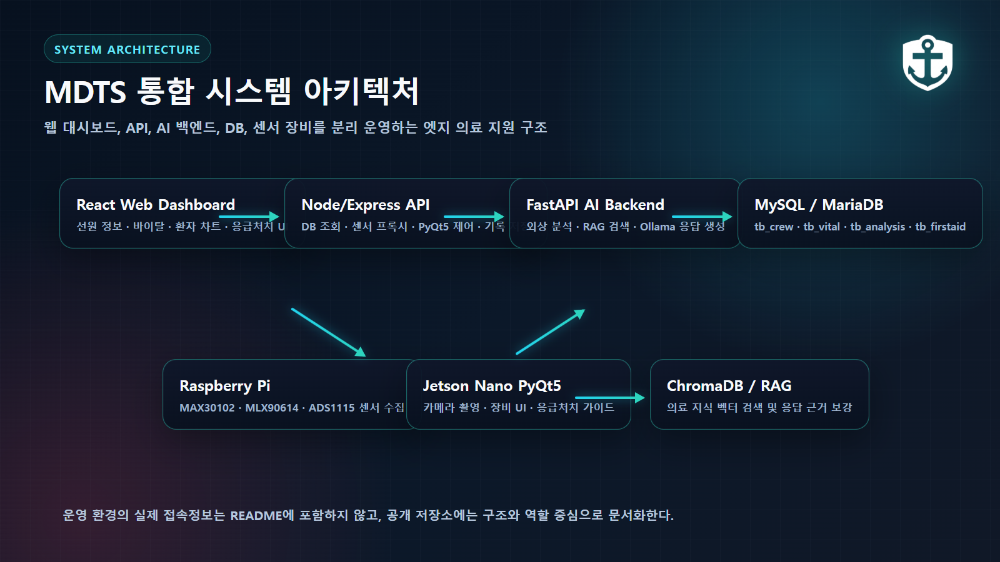

* React Web Dashboard : 선원 정보, 바이탈, 환자 차트, 응급처치 UI 제공
* Node/Express API : DB 조회, 센서 프록시, 장비 제어 요청, 기록 저장 흐름 담당
* FastAPI AI Backend : 외상 분석, RAG 검색, AI 응답 생성 담당
* MySQL/MariaDB : 선원·바이탈·AI 분석·응급처치 기록 저장
* Raspberry Pi / Jetson Nano : 센서 수집, 카메라 촬영, PyQt5 장비 UI 구동

## 유스 케이스

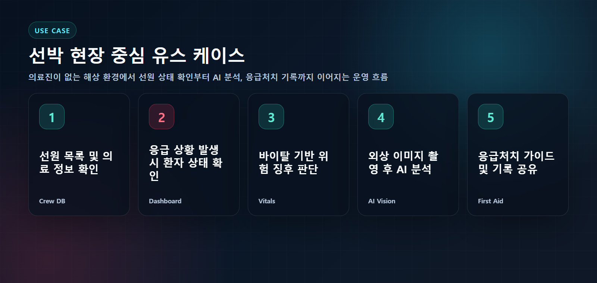

* 선원 목록 및 환자 기본 정보 확인
* 응급 상황 발생 시 환자 상태 대시보드 확인
* 바이탈 측정값 기반 상태 판단
* 외상 이미지 촬영 후 AI 분석 요청
* 응급처치 가이드 및 환자 기록 확인

## 서비스 흐름도

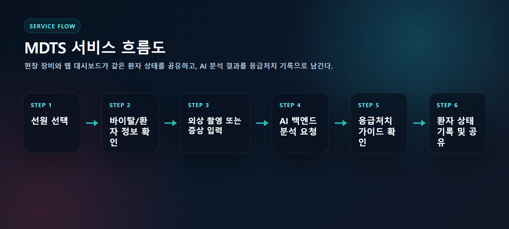

1. 선원 선택
2. 바이탈 및 환자 정보 확인
3. 외상 촬영 또는 증상 입력
4. AI 백엔드 분석 요청
5. 응급처치 가이드 확인
6. 환자 상태 기록 및 공유

## ER 다이어그램

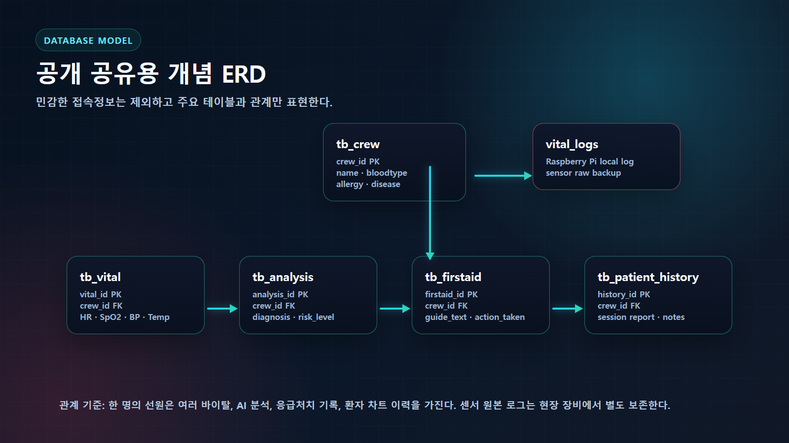

| 테이블 | 역할 |
| --- | --- |
| `tb_crew` | 선원 기본 정보 |
| `tb_vital` | 심박수, 산소포화도, 혈압, 체온 등 바이탈 측정값 |
| `tb_analysis` | AI 분석 결과와 위험도 |
| `tb_firstaid` | 응급처치 가이드 및 조치 기록 |
| `tb_patient_history` | 환자 차트 이력과 세션 기록 |
| `vital_logs` | 현장 장비 기준 센서 원본 로그 백업 |

## 화면 구성 캡처

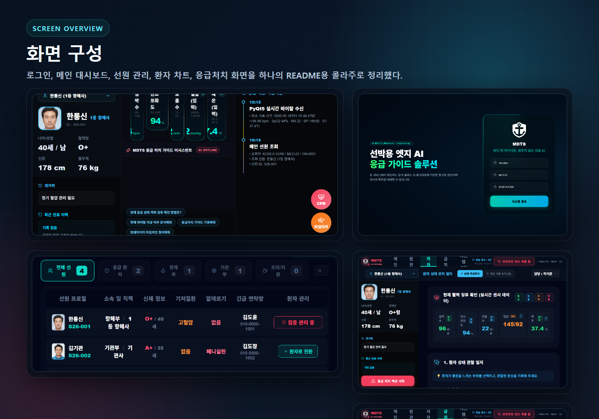

* 로그인 화면 : 선박·장비 식별 기반 시스템 접속 화면
* 메인 대시보드 : 현재 선원, 바이탈, 상태 타임라인, AI 질의응답 진입
* 선원 관리 : 선원 목록, 부서 필터, 환자 전환, 집중 관리 상태 확인
* 환자 차트 : 환자 상태 관찰 일지와 활력 징후 기록
* 응급처치 : 외상 촬영, AI 분석 결과, 응급처치 안내 흐름

세부 화면 캡처 보기

<table>
  <tr>
    <td align="center">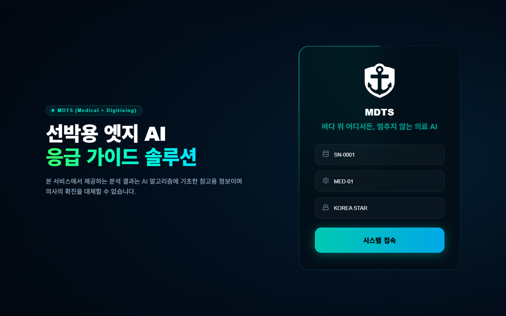 로그인</td>
    <td align="center">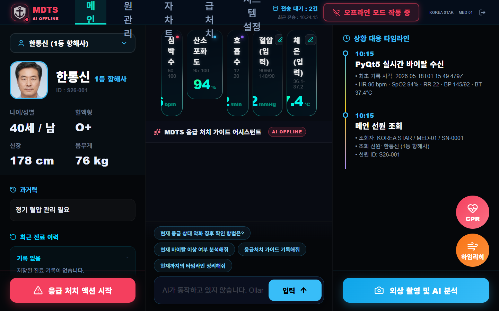 메인 대시보드</td>
  </tr>
  <tr>
    <td align="center">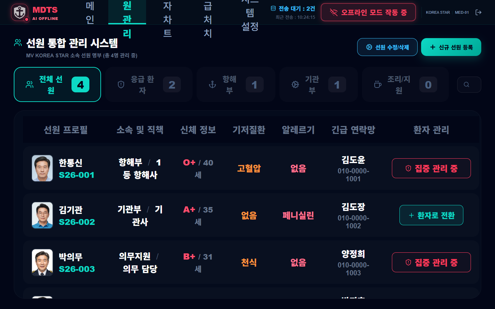 선원 관리</td>
    <td align="center">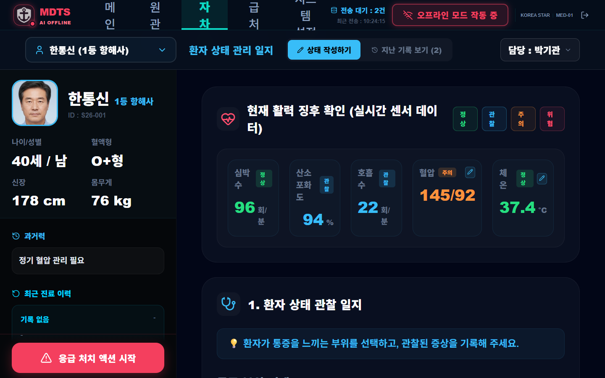 환자 차트</td>
  </tr>
  <tr>
    <td align="center" colspan="2">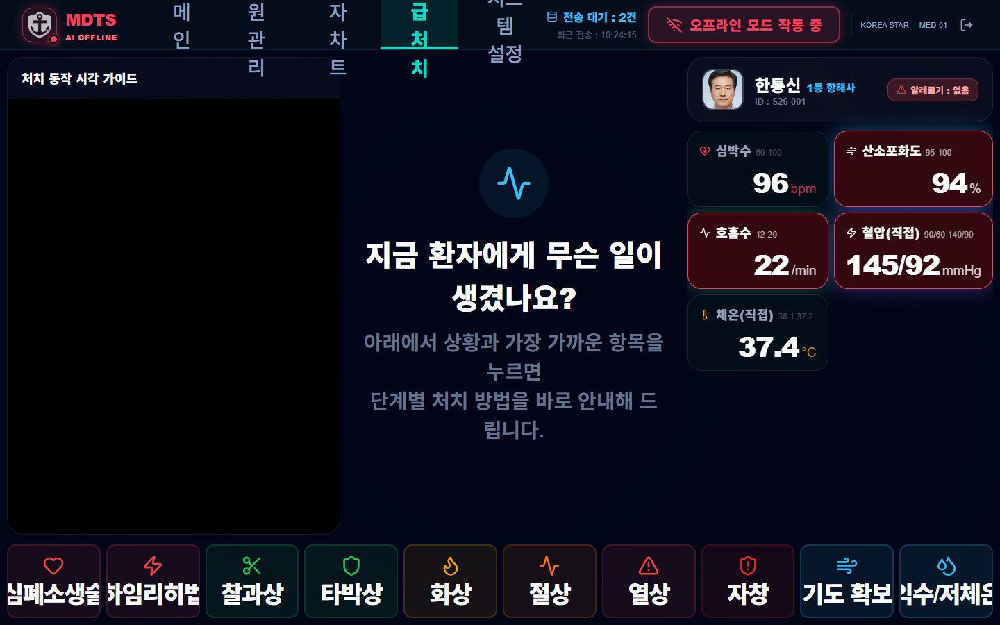 응급처치</td>
  </tr>
</table>

## Edge Device Runtime

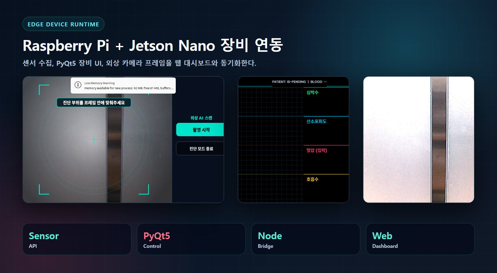

* Raspberry Pi : MAX30102, MLX90614, ADS1115 기반 바이탈 센서 수집
* Jetson Nano : PyQt5 기반 장비 UI와 외상 카메라 프레임 처리
* Web Dashboard : 현장 장비 상태, 환자 선택 상태, 응급처치 화면 동기화
* 운영 정보 : 실제 장비 접속값과 인증값은 공개 README와 이미지에 포함하지 않음

## AI / Data 성능 요약

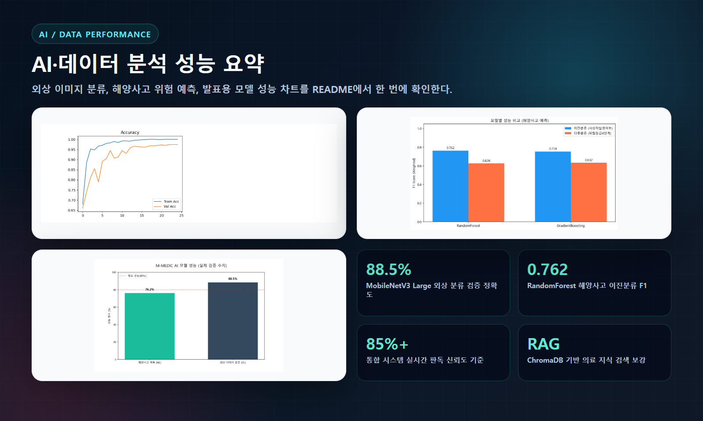

| 항목 | 결과 |
| --- | --- |
| DL 외상 분류 | MobileNetV3 Large, 검증 Accuracy 88.5% |
| ML 해양사고 위험 예측 | RandomForest, weighted F1 0.762 |
| 실시간 외상 판독 표시값 | 통합 데모 기준 85.0% 이상 신뢰도 표시 |
| 의료 지식 검색 | ChromaDB 기반 RAG로 응급처치 응답 근거 보강 |

> 성능 수치는 프로젝트 산출물과 발표 차트 기준입니다. 실제 의료 판단에는 검증된 의료 프로토콜과 전문가 확인이 필요합니다.

## 팀원 역할

| 역할 | 담당 |
| --- | --- |
| Project Management | MDTS 팀 |
| Front-End | React/Vite 웹 대시보드, 화면 구성, Vercel 배포 |
| Back-End | Node/Express API, FastAPI AI 서버, 데이터 연동 |
| AI / Data | MobileNetV3, RandomForest, RAG, ChromaDB 기반 의료 응답 흐름 |
| Edge Device | Raspberry Pi 센서 수집, Jetson Nano PyQt5 장비 UI |
| Deployment / Docs | GitHub 공유본 정리, README 포트폴리오화, 보안 정보 제외 |

## Trouble Shooting

* Vercel 배포 환경과 로컬 엣지 장치 연동
  * 로컬 장치 API는 외부에서 직접 접근할 수 없어 터널 또는 중계 API 구성이 필요
  * 공개 README에는 구조와 역할만 문서화하고 운영 접속값은 제외
* Private 저장소 공유 제한
  * 통합 원본 저장소는 운영 설정이 포함될 수 있어 권한 있는 사용자만 열람 가능
  * 공개 조직 저장소에는 프로젝트 소개, 배포 링크, 포트폴리오용 이미지 중심으로 공유
* Edge Device 네트워크 변동
  * 장비 위치와 네트워크가 바뀌는 경우 환경변수 기반으로 연결값을 갱신
  * 코드와 문서에 운영 접속값을 직접 고정하지 않음
* 의료 응답 안전성
  * 바이탈 이상 여부, 고위험 외상, 응급처치 안내를 규칙 기반 판단과 AI 응답으로 분리
  * AI 결과는 보조 정보로 제한하고 고위험 상황은 의료진 또는 의료관리자 확인 대상으로 처리
* 센서/카메라 런타임 상태 분리
  * 센서 수집, 카메라 촬영, 웹 화면 상태를 타임라인으로 기록
  * 장비 장애 시 웹 대시보드와 현장 장비 화면에서 상태를 분리 확인

## 보안 및 의료 안전 안내

* README와 이미지에는 실제 DB/SSH/API 인증값, 장비 접속값, 계정 시크릿을 포함하지 않습니다.
* 화면 캡처는 README 제작용 목업 데이터와 비식별 데이터를 사용합니다.
* 실제 선원 개인정보와 의료기록은 저장·전송·공유 단계에서 마스킹, 접근 제어, 로그 최소화가 필요합니다.
* 운영 환경에서는 `.env.example` 기반 환경변수와 별도 보안 저장소를 사용합니다.
* AI 분석 결과는 응급처치 보조 정보이며 의료진의 진단, 처방, 최종 의사결정을 대체하지 않습니다.
